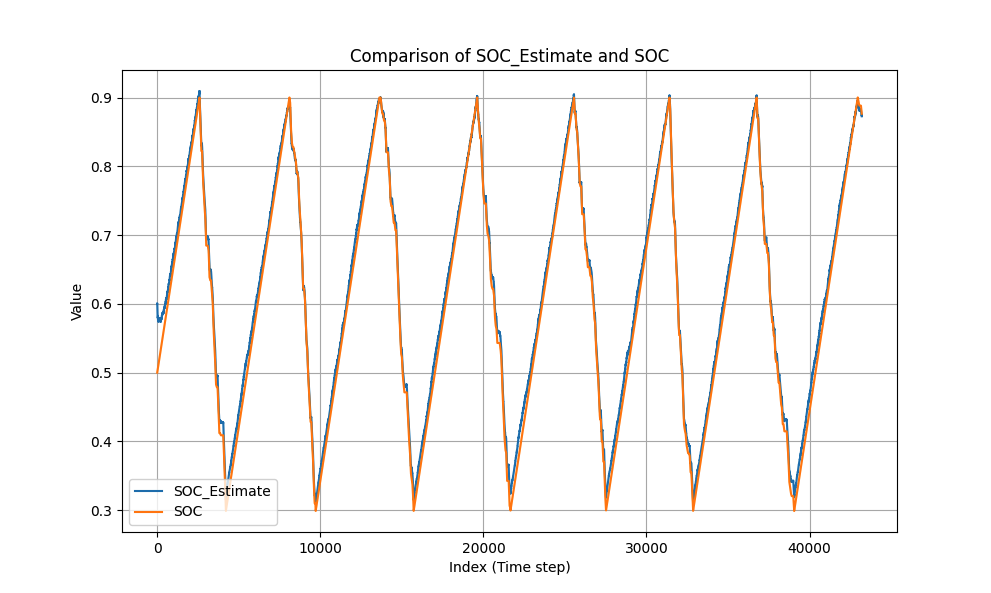

# EKF-SoC (C++)

C++ implementation of an Extended Kalman Filter for battery State‑of‑Charge estimation.

## Requirements
- CMake ≥ 3.16
- C++17 compiler

## Quick Start (Unix)
```bash
# from repo root
cmake -S . -B build -DCMAKE_BUILD_TYPE=Release -DCMAKE_EXPORT_COMPILE_COMMANDS=ON
cmake --build build -j
./build/ekf_soc_app
```

## Test Data
- All data in `signals.csv` was generated from a MATLAB/Simulink project described here: https://www.mathworks.com/help/simscape-battery/ref/socestimatorkalmanfilter.html
- The data in `signals_with_est.csv` is the logged output estimate from running `main.cpp`
- Run `validate_data.py` to see a graph comparing the SOC estimate and the true SOC.

Estimate with initial SOC estimate 10% off from true SOC.
